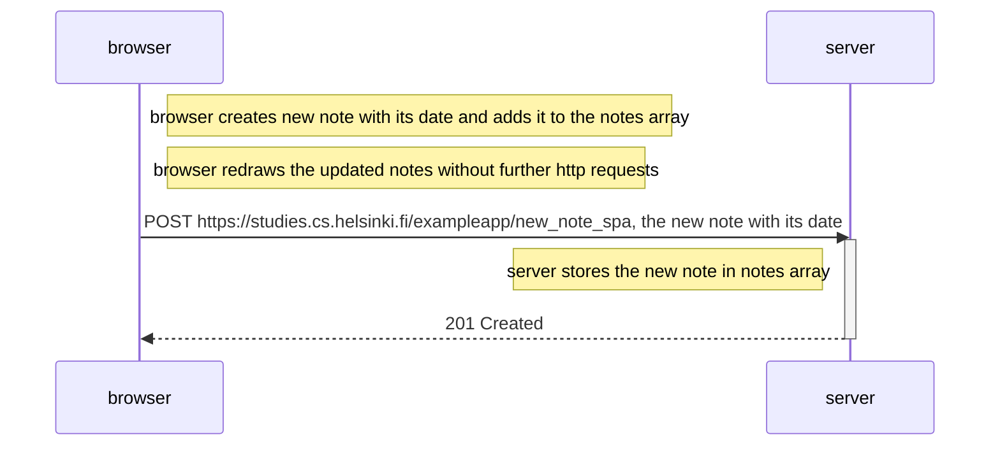

```mermaid
sequenceDiagram
    participant browser
    participant server

    Note right of browser: browser creates new note with its date and adds it to the notes array
    Note right of browser: browser redraws the updated notes without further http requests

    browser->>server: POST https://studies.cs.helsinki.fi/exampleapp/new_note_spa, the new note with its date
    activate server
    Note left of server: server stores the new note in notes array
    server-->>browser: 201 Created
    deactivate server
```
